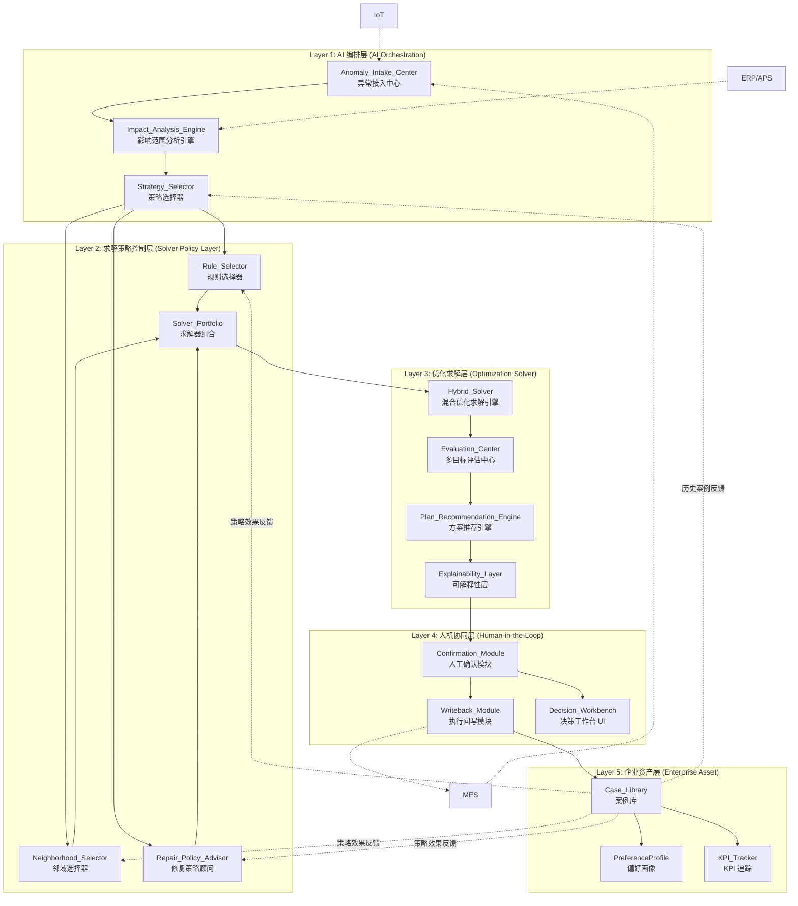
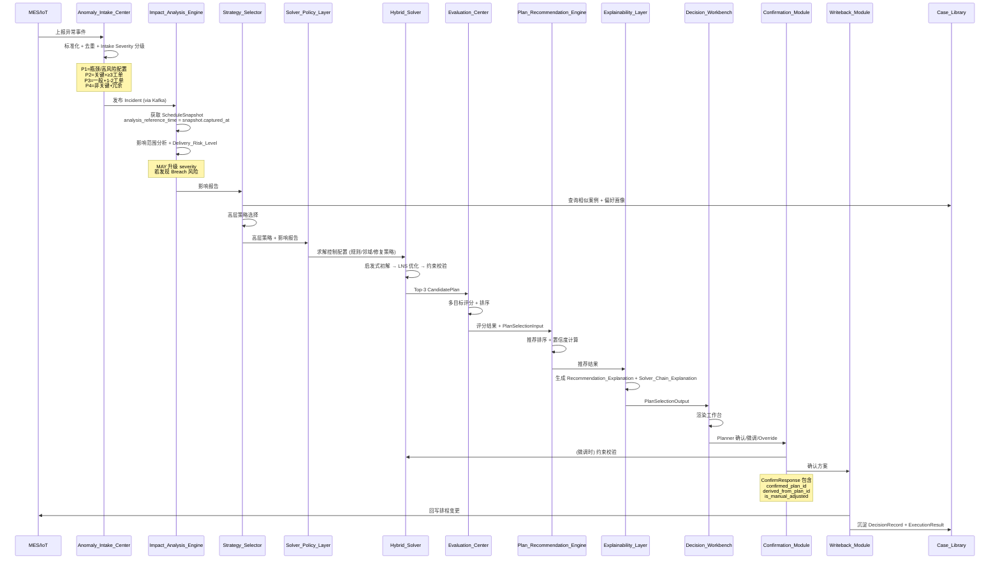
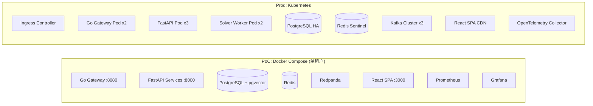

# 设计文档：ReOrch 智策 — 异常重决策编排系统

## 概述

### 设计目标

ReOrch 智策是一套 AI 驱动的异常重决策编排系统，定位于 ERP/MES/APS 之上的决策层。系统在工厂异常（MVP 聚焦设备故障）发生时，基于实时生产上下文，快速识别影响范围、选择求解路径、生成多个可执行候选方案、支持人工确认与微调，并将决策经验沉淀为企业资产。

核心设计原则：
- **AI Orchestration + Solver Policy Layer + OR Solver + Human-in-the-loop** 混合决策架构
- 五层分离：AI 编排层、求解策略控制层、优化求解层、人机协同层、企业资产层
- 求解策略控制层独立封装，不直接生成排程，为优化求解层提供可替换、可审计、可演进的求解控制策略
- 所有时间计算基于 `analysis_reference_time = schedule_snapshot.captured_at`，确保可复现性
- 人始终拥有最终决策权（Human-in-the-loop）

### 技术栈

| 层级 | 技术选型 |
|------|----------|
| API 网关 | Go (高性能网关) |
| 后端服务 | Python 3.11+ / FastAPI |
| 约束求解 | Google OR-Tools CP-SAT |
| 消息队列 | Kafka / Redpanda |
| 主数据库 | PostgreSQL 16 + pgvector 扩展 |
| 缓存 | Redis 7 |
| 向量检索 | pgvector (案例相似度) |
| 前端框架 | React 18 + TypeScript 5 |
| 状态管理 | Zustand |
| UI 组件库 | Ant Design 5 |
| 可视化 | AntV G2 / G6 (甘特图) |
| 可观测性 | Prometheus + Grafana + OpenTelemetry |
| 容器化 | Docker Compose (PoC) / Kubernetes (Prod) |


## 架构

### 五层架构总览



### 核心决策流程时序图



### 部署视图




## 组件与接口

### Layer 1: AI 编排层

#### 1.1 Anomaly_Intake_Center（异常接入中心）

职责：统一接入、标准化、去重、Intake Severity 分级。

**Intake Severity 分级规则（两阶段设计）：**
- AIC 仅执行 Intake Severity 分级，基于资源关键程度，不依赖下游影响分析
- P1-Critical：故障资源为瓶颈设备或高风险配置（如单点设备、无冗余备份）
- P2-High：故障资源为关键资源且关联 ≥3 个在制工单
- P3-Medium：故障资源为一般资源且关联 1-2 个在制工单
- P4-Low：故障资源为非关键资源且存在冗余备份
- IAE MAY 在影响分析完成后升级 severity（仅升级不降级），若发现 Breach 级交付风险

```python
# --- anomaly_intake_center.py ---

from enum import Enum
from datetime import datetime
from pydantic import BaseModel, Field
from uuid import UUID, uuid4
from typing import Optional


class IncidentSeverity(str, Enum):
    P1_CRITICAL = "P1-Critical"
    P2_HIGH = "P2-High"
    P3_MEDIUM = "P3-Medium"
    P4_LOW = "P4-Low"


class IncidentType(str, Enum):
    EQUIPMENT_FAILURE = "equipment_failure"


class IncidentStatus(str, Enum):
    PENDING_ANALYSIS = "pending_analysis"
    ANALYZING = "analyzing"
    PENDING_CONFIRMATION = "pending_confirmation"
    CONFIRMED = "confirmed"
    EXECUTING = "executing"
    CLOSED = "closed"


class ReportSource(str, Enum):
    MES = "MES"
    IOT = "IoT"
    MANUAL = "manual"


class IncidentCreateRequest(BaseModel):
    incident_type: IncidentType
    occurred_at: datetime
    resource_id: str
    report_source: ReportSource
    description: Optional[str] = None
    raw_payload: Optional[dict] = None


class Incident(BaseModel):
    incident_id: UUID = Field(default_factory=uuid4)
    incident_type: IncidentType
    occurred_at: datetime
    resource_id: str
    report_source: ReportSource
    severity: IncidentSeverity
    status: IncidentStatus = IncidentStatus.PENDING_ANALYSIS
    description: Optional[str] = None
    deduplicated_from: list[UUID] = Field(default_factory=list)
    created_at: datetime = Field(default_factory=datetime.utcnow)
    raw_payload: Optional[dict] = None


class IntakeSeverityClassifier:
    """
    Intake Severity 分级器。
    仅基于资源关键程度分级，不依赖下游影响分析结果。
    """

    def classify(
        self,
        resource_id: str,
        resource_criticality: str,
        is_bottleneck: bool,
        has_redundancy: bool,
        active_work_order_count: int,
    ) -> IncidentSeverity:
        if is_bottleneck or resource_criticality == "high_risk_config":
            return IncidentSeverity.P1_CRITICAL
        if resource_criticality == "critical" and active_work_order_count >= 3:
            return IncidentSeverity.P2_HIGH
        if resource_criticality == "general" and 1 <= active_work_order_count <= 2:
            return IncidentSeverity.P3_MEDIUM
        if resource_criticality == "non_critical" and has_redundancy:
            return IncidentSeverity.P4_LOW
        return IncidentSeverity.P3_MEDIUM  # 默认 fallback


class AnomalyIntakeCenter:
    """异常接入中心：接收、标准化、去重、Intake Severity 分级、发布。"""

    async def receive_event(self, request: IncidentCreateRequest) -> Incident:
        """接收并标准化异常事件，5 秒内返回确认回执。"""
        ...

    async def deduplicate(self, incident: Incident) -> Incident:
        """10 分钟窗口内同一资源去重合并。"""
        ...

    async def publish_to_stream(self, incident: Incident) -> None:
        """发布到 Kafka/Redpanda 事件流。"""
        ...
```

#### 1.2 Impact_Analysis_Engine（影响范围分析引擎）

职责：识别异常影响的工单、工序、资源、交期风险。可在分析完成后升级 Incident severity。

**时间基准设计：**
- `analysis_reference_time = schedule_snapshot.captured_at`
- 所有缓冲时间计算、交期风险评估均基于此时间点
- 确保同一快照下的分析结果可复现

```python
# --- impact_analysis_engine.py ---

from enum import Enum
from pydantic import BaseModel, Field
from uuid import UUID
from datetime import datetime


class DeliveryRiskLevel(str, Enum):
    SAFE = "safe"
    WARNING = "warning"
    BREACH = "breach"


class AffectedOperation(BaseModel):
    operation_id: str
    work_order_id: str
    resource_id: str
    is_direct: bool  # True=直接受影响, False=间接(下游传播)
    estimated_delay_minutes: float


class AffectedWorkOrder(BaseModel):
    work_order_id: str
    product_name: str
    due_date: datetime
    delivery_risk_level: DeliveryRiskLevel
    remaining_buffer_minutes: float
    affected_operations: list[AffectedOperation]


class ImpactReport(BaseModel):
    incident_id: UUID
    schedule_snapshot_id: UUID
    analysis_reference_time: datetime  # = schedule_snapshot.captured_at
    affected_work_orders: list[AffectedWorkOrder]
    affected_operations: list[AffectedOperation]
    affected_resource_ids: list[str]
    delivery_risk_distribution: dict[DeliveryRiskLevel, int]
    estimated_total_delay_minutes: float
    is_degraded_mode: bool = False
    degraded_reason: str | None = None
    severity_upgraded: bool = False
    upgraded_severity: "IncidentSeverity | None" = None


class ImpactAnalysisEngine:
    """
    影响范围分析引擎。
    analysis_reference_time = schedule_snapshot.captured_at，确保可复现。
    MAY 升级 severity 若发现 Breach 风险。
    """

    async def analyze(
        self, incident: "Incident", snapshot: "ScheduleSnapshot"
    ) -> ImpactReport:
        """
        10 秒内完成影响范围分析。
        analysis_reference_time = snapshot.captured_at
        """
        ...

    def _propagate_downstream(
        self, direct_ops: list[AffectedOperation], snapshot: "ScheduleSnapshot"
    ) -> list[AffectedOperation]:
        """沿工艺路线向下游传播，识别间接受影响工序。"""
        ...

    def _calculate_delivery_risk(
        self,
        work_order: "WorkOrder",
        affected_ops: list[AffectedOperation],
        reference_time: datetime,
    ) -> DeliveryRiskLevel:
        """
        基于剩余工序时间、缓冲时间与交期差值计算交付风险。
        所有计算基于 analysis_reference_time。
        """
        ...

    def _maybe_upgrade_severity(
        self, incident: "Incident", report: ImpactReport
    ) -> ImpactReport:
        """若发现 Breach 风险，MAY 升级 severity（仅升级不降级）。"""
        ...
```

#### 1.3 Strategy_Selector（策略选择器 / AI Orchestrator）

```python
# --- strategy_selector.py ---

from enum import Enum
from pydantic import BaseModel
from uuid import UUID


class StrategyType(str, Enum):
    WAIT_AND_REPAIR = "wait_and_repair"
    LOCAL_REPAIR = "local_repair"
    GLOBAL_RESCHEDULE = "global_reschedule"


class StrategyRecommendation(BaseModel):
    strategy_type: StrategyType
    confidence: float  # 0-1
    key_factors: list[str]
    historical_case_ids: list[UUID]
    alternative_strategy: StrategyType | None = None  # 置信度 < 0.5 时提供
    reasoning: str


class StrategySelector:
    """
    高层策略选择器。仅负责 Wait/Local/Global 三类策略选择。
    不决定具体调度规则、邻域算子或修复强度。
    """

    async def select_strategy(
        self,
        impact_report: ImpactReport,
        similar_cases: list["CaseRecord"],
        preference_profile: "PreferenceProfile",
        total_active_work_orders: int,
        estimated_repair_time_minutes: float,
    ) -> StrategyRecommendation:
        ...
```


### Layer 2: 求解策略控制层

#### 2.1 Rule_Selector（规则选择器）

```python
# --- rule_selector.py ---

from enum import Enum
from pydantic import BaseModel
from uuid import UUID


class RuleCategory(str, Enum):
    DUE_DATE_PRIORITY = "due_date_priority"
    SHORTEST_PROCESSING_TIME = "shortest_processing_time"
    MINIMUM_SLACK_TIME = "minimum_slack_time"
    BOTTLENECK_RESOURCE_PRIORITY = "bottleneck_resource_priority"
    CRITICAL_ORDER_PRIORITY = "critical_order_priority"


class RuleApplicableStage(str, Enum):
    INITIAL_SOLUTION = "initial_solution"
    REPAIR = "repair"


class RuleSelectionResult(BaseModel):
    rule_name: str
    rule_category: RuleCategory
    applicable_stage: RuleApplicableStage
    confidence: float  # 0-1
    reasoning: str
    alternative_rule: str | None = None  # 置信度 < 0.5 时提供


class RuleSelector:
    """
    规则选择器：根据异常特征、影响范围、策略、历史案例选择调度规则。
    支持规则式、打分模型、学习型三种可替换实现。
    """

    async def select_rules(
        self,
        incident: "Incident",
        impact_report: "ImpactReport",
        strategy: "StrategyRecommendation",
        preference_profile: "PreferenceProfile",
        similar_cases: list["CaseRecord"],
    ) -> list[RuleSelectionResult]:
        ...
```

#### 2.2 Neighborhood_Selector（邻域选择器）

```python
# --- neighborhood_selector.py ---

from enum import Enum
from pydantic import BaseModel


class NeighborhoodType(str, Enum):
    CRITICAL_PATH = "critical_path"
    BOTTLENECK_DEVICE = "bottleneck_device"
    DELAYED_ORDER = "delayed_order"
    SAME_DEVICE_SWAP = "same_device_swap"
    OPERATION_INSERT = "operation_insert"
    DEVICE_REASSIGNMENT = "device_reassignment"


class NeighborhoodConfig(BaseModel):
    neighborhood_type: NeighborhoodType
    target_operation_ids: list[str]
    intensity: float  # 0-1, 邻域强度
    estimated_impact_scope: int  # 预计影响工序数
    reasoning: str


class NeighborhoodSelector:
    """
    邻域选择器：动态选择 LNS 邻域算子和搜索范围。
    Local-Repair 时优先局部邻域，禁止默认扩展到全局。
    支持"不变性保护"：未受影响工序默认不进入搜索范围。
    """

    async def select_neighborhood(
        self,
        current_solution: "CandidatePlan",
        affected_operation_ids: list[str],
        stagnation_count: int,
        remaining_budget_seconds: float,
        strategy: "StrategyRecommendation",
        perturbation_constraint: float,
    ) -> list[NeighborhoodConfig]:
        ...
```

#### 2.3 Repair_Policy_Advisor（修复策略顾问）

```python
# --- repair_policy_advisor.py ---

from enum import Enum
from pydantic import BaseModel


class RepairMode(str, Enum):
    CONSERVATIVE = "conservative"
    BALANCED = "balanced"
    AGGRESSIVE = "aggressive"


class RepairPolicyConfig(BaseModel):
    repair_mode: RepairMode
    frozen_operation_ids: list[str]
    allowed_perturbation_scope: list[str]  # 允许扰动的工序 ID
    search_time_budget_seconds: float
    candidate_count_target: int  # 候选解数量目标
    fallback_condition: str  # 回退条件描述
    fallback_mode: str  # 回退模式


class RepairPolicyAdvisor:
    """
    修复策略顾问：决定修复强度、冻结范围、搜索预算、回退策略。
    Wait-and-Repair → 最小扰动 + 冻结所有未受影响工序
    Local-Repair → 限制在受影响工序及直接下游
    Global-Reschedule → 允许更大范围调整 + 提升预算
    """

    async def advise(
        self,
        strategy: "StrategyRecommendation",
        impact_report: "ImpactReport",
        incident_severity: "IncidentSeverity",
    ) -> RepairPolicyConfig:
        ...
```

#### 2.4 Solver_Portfolio（求解器组合）

```python
# --- solver_portfolio.py ---

from pydantic import BaseModel


class SolverChainConfig(BaseModel):
    primary_solver: str
    fallback_solver: str
    fallback_rule: str
    degradation_trigger: str  # 降级触发条件
    max_timeout_seconds: float


class SolverPortfolio:
    """
    求解器组合管理：维护不同高层策略对应的主求解器、备选求解器和降级规则。
    支持版本化管理和审计日志。
    """

    def get_chain_config(self, strategy_type: "StrategyType") -> SolverChainConfig:
        ...
```


### Layer 3: 优化求解层

#### 3.1 Hybrid_Solver（混合优化求解引擎）

```python
# --- hybrid_solver.py ---

from pydantic import BaseModel, Field
from uuid import UUID, uuid4
from datetime import datetime


class SolverChain(BaseModel):
    """某一候选方案生成过程中实际执行的阶段化算法链路。"""
    strategy_type: str
    rule_selection: str
    neighborhood_selection: str
    repair_policy: str
    solver_name: str
    key_parameters: dict
    search_budget_seconds: float
    constraint_validation_result: str
    stages: list[str]  # e.g. ["规则选择", "初解生成", "邻域选择", "LNS修复", "约束校验"]


class SolverMetadata(BaseModel):
    solve_time_seconds: float
    iteration_count: int
    objective_trajectory: list[float]
    degradation_occurred: bool = False
    degradation_reason: str | None = None


class ConstraintViolation(BaseModel):
    constraint_type: str
    operation_id: str
    resource_id: str | None = None
    detail: str


class ConstraintValidationReport(BaseModel):
    is_feasible: bool
    violations: list[ConstraintViolation]
    checked_constraints: list[str]


class CandidatePlan(BaseModel):
    plan_id: UUID = Field(default_factory=uuid4)
    strategy_type: str
    schedule_detail: "ScheduleDetail"
    gantt_version: str
    solver_chain: SolverChain
    feasibility_status: str  # "feasible" | "infeasible" | "timeout_partial"
    solver_metadata: SolverMetadata
    constraint_report: ConstraintValidationReport
    created_at: datetime = Field(default_factory=datetime.utcnow)


class HybridSolver:
    """
    混合优化求解引擎：启发式初解 + LNS 优化 + 约束校验。
    60 秒内生成 Top-3 候选方案。
    调用 Rule_Selector / Neighborhood_Selector / Repair_Policy_Advisor 获取配置。
    支持 Solver_Portfolio 降级切换。
    """

    async def solve(
        self,
        strategy: "StrategyRecommendation",
        impact_report: "ImpactReport",
        snapshot: "ScheduleSnapshot",
        repair_config: "RepairPolicyConfig",
        rules: list["RuleSelectionResult"],
        portfolio_config: "SolverChainConfig",
    ) -> list[CandidatePlan]:
        """60 秒内输出 Top-3 候选方案。"""
        ...

    async def validate_constraints(
        self, plan: CandidatePlan, snapshot: "ScheduleSnapshot"
    ) -> ConstraintValidationReport:
        """对候选方案或微调方案执行全部硬约束校验。"""
        ...

    async def validate_microadjustment(
        self,
        original_plan: CandidatePlan,
        adjusted_schedule: "ScheduleDetail",
        snapshot: "ScheduleSnapshot",
    ) -> ConstraintValidationReport:
        """对 Planner 微调后的方案重新执行约束校验。"""
        ...
```

#### 3.2 Evaluation_Center（多目标评估中心）

```python
# --- evaluation_center.py ---

from pydantic import BaseModel


class KPIVector(BaseModel):
    delayed_order_count: int
    max_delay_minutes: float
    spi: float  # Schedule Perturbation Index
    resource_utilization_delta: float
    changeover_count_delta: int
    critical_order_otd_impact: float
    normalized_score: float  # 归一化综合评分 0-1


class ComparisonMatrixRow(BaseModel):
    plan_id: str
    kpi_vector: KPIVector
    delta_vs_baseline: dict[str, float]  # 与原排程的差值
    is_score_close: bool  # 与第一名差值 < 5%


class ComparisonMatrix(BaseModel):
    rows: list[ComparisonMatrixRow]
    normalization_method: str
    score_unit_descriptions: dict[str, str]
    baseline_snapshot_id: str


class EvaluationCenter:
    """
    多目标评估中心：对候选方案进行多维度评分、排序、对比。
    不直接决定最终推荐方案。
    """

    async def evaluate(
        self,
        candidates: list["CandidatePlan"],
        snapshot: "ScheduleSnapshot",
        goal_mode: "GoalMode",
    ) -> ComparisonMatrix:
        ...
```

#### 3.3 Plan_Recommendation_Engine（方案推荐引擎）

```python
# --- plan_recommendation_engine.py ---

from pydantic import BaseModel
from uuid import UUID


class GanttDiffPayload(BaseModel):
    baseline_snapshot_id: str
    candidate_plan_id: str
    adjusted_operations: list[dict]
    time_shifts: list[dict]
    resource_switches: list[dict]
    critical_path_changes: list[dict]


class PlanSelectionOutput(BaseModel):
    recommended_plan_id: UUID
    recommended_rank: int
    top_scored_plan_id: UUID
    recommendation_confidence: float  # 0-1
    auto_preselected: bool
    ranked_plan_list: list[dict]
    reason_codes: list[str]
    reason_summary: str
    risk_flags: list[str]
    comparison_matrix: ComparisonMatrix
    gantt_diff_payload: GanttDiffPayload
    goal_mode_used: str
    weights_used: dict[str, float]
    matched_case_ids: list[UUID]
    alternative_plan_ids: list[UUID]
    audit_metadata: dict


class PlanRecommendationEngine:
    """
    方案推荐引擎：基于评分、目标模式、偏好、案例确定推荐方案。
    区分"综合评分第一"和"最终 AI 推荐"。
    输入为 PlanSelectionInput，输出为 PlanSelectionOutput。
    """

    async def recommend(
        self, selection_input: "PlanSelectionInput"
    ) -> PlanSelectionOutput:
        """5 秒内输出推荐方案。"""
        ...
```

#### 3.4 Explainability_Layer（可解释性层）

```python
# --- explainability_layer.py ---

from pydantic import BaseModel


class RecommendationExplanation(BaseModel):
    core_reasons: list[str]  # 不超过 3 条
    key_advantages: list[str]
    main_risks: list[str]
    comparison_with
_alternatives: list[dict]
    summary: str  # 不超过 200 字
    referenced_case_ids: list[str]


class SolverChainExplanation(BaseModel):
    algorithm_category: str
    applicable_scenario: str
    chain_reason: str
    optimization_objectives: list[str]
    computation_time_seconds: float
    stages: list[str]
    frozen_constraints: list[str] | None = None


class ExplainabilityLayer:
    """
    可解释性层：生成 Recommendation_Explanation 和 Solver_Chain_Explanation。
    使用业务术语，不负责评分或推荐决策本身。
    输出结构化数据对象，支持前端自然语言渲染。
    """

    async def explain_recommendation(
        self,
        recommended_plan: "CandidatePlan",
        alternatives: list["CandidatePlan"],
        comparison_matrix: "ComparisonMatrix",
        matched_cases: list["CaseRecord"],
    ) -> RecommendationExplanation:
        ...

    async def explain_solver_chain(
        self, plan: "CandidatePlan"
    ) -> SolverChainExplanation:
        ...
```

### Layer 4: 人机协同层

#### 4.1 Confirmation_Module（人工确认模块）

```python
# --- confirmation_module.py ---

from enum import Enum
from pydantic import BaseModel
from uuid import UUID
from datetime import datetime


class ConfirmAction(str, Enum):
    ACCEPT = "accept"
    ACCEPT_WITH_ADJUSTMENT = "accept_with_adjustment"
    REJECT_AND_RESELECT = "reject_and_reselect"


class ConfirmRequest(BaseModel):
    incident_id: UUID
    action: ConfirmAction
    selected_plan_id: UUID
    adjustments: list[dict] | None = None  # 微调内容
    override_reason: str | None = None  # 否决时必填
    confirmed_by: str


class ConfirmResponse(BaseModel):
    """
    确认响应。微调时创建新方案版本，链接到原始方案。
    """
    confirmed_plan_id: UUID
    derived_from_plan_id: UUID  # 原始方案 ID
    is_manual_adjusted: bool
    constraint_validation: "ConstraintValidationReport"
    decision_record_id: UUID


class DecisionRecord(BaseModel):
    decision_record_id: UUID
    incident_id: UUID
    impact_report_summary: str
    strategy_type: str
    all_candidate_plan_ids: list[UUID]
    recommended_plan_id: UUID
    confirmed_plan_id: UUID
    derived_from_plan_id: UUID  # 微调时链接到原始方案
    is_override: bool
    is_manual_adjusted: bool
    override_reason: str | None = None
    confirmed_by: str
    confirmed_at: datetime
    plan_selection_input_version: str
    plan_selection_output_version: str
    solver_chain: "SolverChain"
    rule_selector_version: str
    neighborhood_selector_version: str
    repair_policy_advisor_version: str


class ConfirmationModule:
    """
    人工确认模块：确认/微调/Override。
    微调创建新方案版本（derived_from_plan_id 链接原始方案）。
    RBAC: Planner 可确认/微调/否决, Shop_Floor_Executor 仅查看, Management 审批 P1。
    15 分钟超时提醒。
    """

    async def confirm(self, request: ConfirmRequest) -> ConfirmResponse:
        ...

    async def check_timeout(self, incident_id: UUID) -> None:
        """15 分钟未确认时发送超时提醒。"""
        ...
```

#### 4.2 Writeback_Module（执行回写模块）

```python
# --- writeback_module.py ---

from pydantic import BaseModel
from uuid import UUID
from datetime import datetime


class WritebackStatus(str, Enum):
    SUCCESS = "success"
    PARTIAL_SUCCESS = "partial_success"
    FAILED = "failed"


class ExecutionResult(BaseModel):
    incident_id: UUID
    decision_record_id: UUID
    actual_completion_times: dict[str, datetime]
    planned_completion_times: dict[str, datetime]
    actual_otd: float
    actual_resource_utilization: float
    deviation_percentage: float


class WritebackModule:
    """
    执行回写模块：将确认方案同步到 MES，追踪执行结果。
    回写前转换为目标 MES 数据格式。
    每 5 分钟追踪执行进度，偏差 > 10% 告警。
    """

    async def writeback_to_mes(
        self, confirmed_plan: "CandidatePlan", decision_record: DecisionRecord
    ) -> WritebackStatus:
        ...

    async def track_execution(self, incident_id: UUID) -> ExecutionResult:
        ...
```

### Layer 5: 企业资产层

#### 5.1 Case_Library（案例库）

```python
# --- case_library.py ---

from pydantic import BaseModel
from uuid import UUID
from datetime import datetime


class CaseRecord(BaseModel):
    case_id: UUID
    incident_features: dict
    impact_scope: dict
    strategy_type: str
    confirmed_plan_summary: str
    execution_result: ExecutionResult | None
    is_override: bool
    override_reason: str | None
    rule_selection: str
    neighborhood_selection: str
    repair_policy: str
    solver_chain: "SolverChain"
    created_at: datetime
    embedding_vector: list[float] | None = None  # pgvector


class CaseTemplate(BaseModel):
    template_id: UUID
    template_name: str
    applicable_incident_types: list[str]
    recommended_strategy: str
    key_parameter_thresholds: dict
    status: str  # "draft" | "published"
    reference_count: int = 0
    adoption_rate: float = 0.0
    created_by: str
    created_at: datetime


class PreferenceProfile(BaseModel):
    planner_id: str
    strategy_preferences: dict[str, float]  # strategy_type -> weight
    adjustment_patterns: list[dict]
    override_history: list[dict]
    updated_at: datetime


class CaseLibrary:
    """
    案例库：沉淀决策案例、模板化、偏好学习。
    使用 pgvector 进行相似案例检索。
    记录完整链路：异常特征→策略→规则→邻域→修复→执行结果。
    """

    async def create_case(
        self, decision_record: DecisionRecord, execution_result: ExecutionResult
    ) -> CaseRecord:
        ...

    async def find_similar_cases(
        self, incident_features: dict, top_k: int = 5, threshold: float = 0.8
    ) -> list[tuple[CaseRecord, float]]:
        """基于 pgvector 相似度检索，返回 (案例, 相似度) 列表。"""
        ...

    async def update_preference(
        self, planner_id: str, decision_record: DecisionRecord
    ) -> PreferenceProfile:
        ...
```

## 数据模型

### 枚举定义

```python
# --- enums.py ---

from enum import Enum

class IncidentSeverity(str, Enum):
    P1_CRITICAL = "P1-Critical"
    P2_HIGH = "P2-High"
    P3_MEDIUM = "P3-Medium"
    P4_LOW = "P4-Low"

class IncidentType(str, Enum):
    EQUIPMENT_FAILURE = "equipment_failure"

class IncidentStatus(str, Enum):
    PENDING_ANALYSIS = "pending_analysis"
    ANALYZING = "analyzing"
    PENDING_CONFIRMATION = "pending_confirmation"
    CONFIRMED = "confirmed"
    EXECUTING = "executing"
    CLOSED = "closed"

class DeliveryRiskLevel(str, Enum):
    SAFE = "safe"
    WARNING = "warning"
    BREACH = "breach"

class StrategyType(str, Enum):
    WAIT_AND_REPAIR = "wait_and_repair"
    LOCAL_REPAIR = "local_repair"
    GLOBAL_RESCHEDULE = "global_reschedule"
