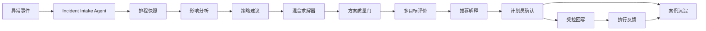

# ReOrch 智策 - 工业异常调度决策 Copilot

ReOrch 智策是一个面向离散制造车间的 AI 产品原型：当设备故障、插单、物料延期、质量返工等异常发生后，系统帮助计划员完成影响分析、策略选择、候选方案生成、多目标评估、人工确认、安全回写和案例沉淀。

这个项目从真实 B 端生产扰动场景出发，完整覆盖产品定义、AI 工作流、可互动 demo、评估指标、安全边界和商业化 PoC 路径。

## 作品集入口

| 材料 | 用途 |
| --- | --- |
| [产品作品集总览](docs/portfolio/product_portfolio.md) | 快速理解项目价值、产品判断和落地证据 |
| [AI 工作流、Prompt 与输入输出示例](docs/portfolio/workflow_prompts_io.md) | 展示 Agent/Workflow 设计、结构化输出、解释与审计样例 |
| [可信性质量门](docs/portfolio/trust_quality_gate.md) | 展示如何判断 LLM 输出是否可信、可行、可审计 |
| [市场需求与行业先进标准对标](docs/portfolio/market_benchmark.md) | 说明为什么不是伪需求，以及如何对标工业 AI/Agent 产品标准 |
| [客户演示路径](docs/demo/customer_demo_walkthrough.md) | 录屏或现场 demo 的端到端讲解脚本 |
| [系统蓝图](docs/product/poc_system_blueprint.md) | 展示 PoC 系统边界、AI 职责和工业现场安全闸门 |

## 一句话定位

不是“让大模型直接自动排产”，而是把 AI 放在可控的异常决策流程中：LLM/Agent 负责异常理解、规则候选、策略解释和经验沉淀；约束引擎、求解器、数字孪生、质量门和计划员确认负责正确性与生产责任。

## 可互动 Demo

本地完整 demo 使用 Docker Compose 启动后端、前端、PostgreSQL/pgvector、Redis、Redpanda 和 mock ERP/MES/APS 集成服务。

```bash
cp .env.example .env
docker compose up --build
```

打开：

```text
http://localhost:3000
```

演示账号：

```text
planner / planner123
```

推荐演示路径：

```text
登录 -> 决策工作台 -> 加载演示场景 -> 影响分析 -> 候选方案
-> 推荐解释 -> 人工确认 -> mock MES 回写 -> 案例库沉淀
```

如果不方便启动外部体验，可以直接查看：

- [AI 工作流、Prompt 与输入输出示例](docs/portfolio/workflow_prompts_io.md)
- [Demo Validation Report](docs/demo/demo_validation_report.md)
- [Frontend Demo Path](docs/demo/frontend_demo_path.md)

## 端到端流程



## 核心能力

| 能力 | 项目体现 |
| --- | --- |
| AI 产品定义 | 明确把 ReOrch 定位为“异常响应层 + 经验资产层”，不是重型 APS 替代品 |
| Agent/Workflow 设计 | 受控多 Agent 流程，所有高风险动作都有结构化输入输出、工具边界和人工确认 |
| 工业数据建模 | WorkOrder、Operation、Machine、ScheduleSnapshot、Incident、DecisionRecord 等 canonical model |
| 多目标决策 | 交付风险、扰动范围、换线、资源切换、可行性、置信度和执行复杂度统一评估 |
| 安全与治理 | schema 校验、数据追溯、硬约束质量门、置信度降级、人工确认、幂等回写、审计记录 |
| 商业化试点 | 离散制造 PoC 数据模板、验收指标、ROI 测算、4-6 周落地路径 |
| 工程落地 | FastAPI、React、Ant Design、OR-Tools、Docker Compose、CI 与自动化测试 |

## 验证命令

```bash
pytest -q
cd frontend && npm run build
make demo-validate
```

当前公开分支验证：

```text
706 passed
frontend production build passed
demo data validation passed
```

## 项目结构

```text
app/          FastAPI 后端、领域模型、Agent 工作流、求解器、确认和回写模块
frontend/     React + Ant Design 前端工作台
demo/         固定 sandbox 演示数据和 demo reset/seed 脚本
benchmark/    异常重排 benchmark、客户样例包、回放和训练数据生成脚本
docs/         产品、商业、集成、试点、验证和 portfolio 文档
.github/      CI: backend tests、frontend build、compose smoke
```

## 技术栈

- Backend: FastAPI, Pydantic v2, SQLAlchemy, PostgreSQL/pgvector, Redis, Redpanda/Kafka, OR-Tools
- Frontend: React, TypeScript, Ant Design, Zustand, Vite
- AI/product workflow: controlled Agent orchestration, prompt-to-structure, rule candidate generation, explainability, case memory
- Deployment: Docker Compose, GitHub Actions smoke validation

## 非宣传边界

本项目证明的是 sandbox demo、customer-like 数据包、集成契约和 PoC-ready 决策闭环；不能宣称已经完成真实客户生产联调，也不能宣称大模型可以绕过求解器、质量门或计划员审批直接修改生产计划。
