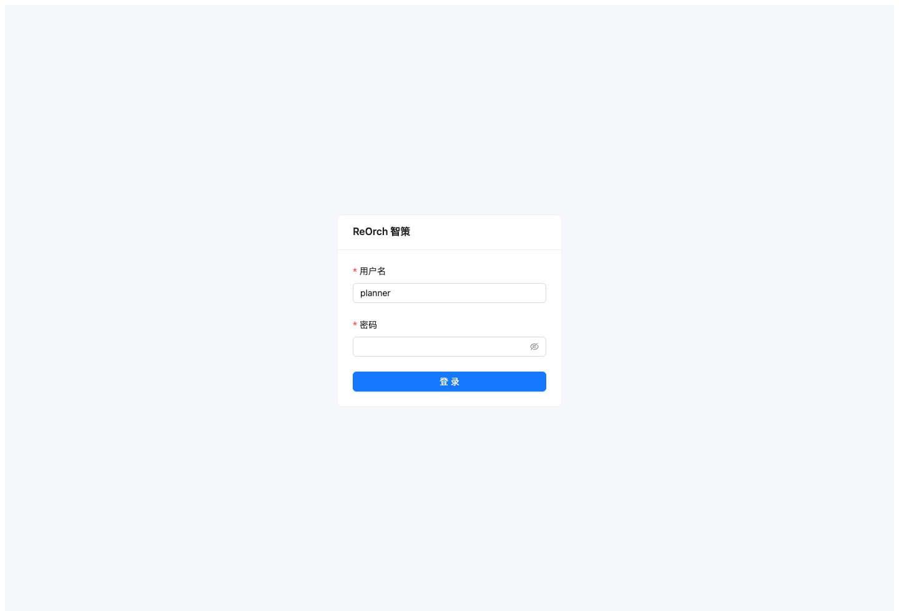
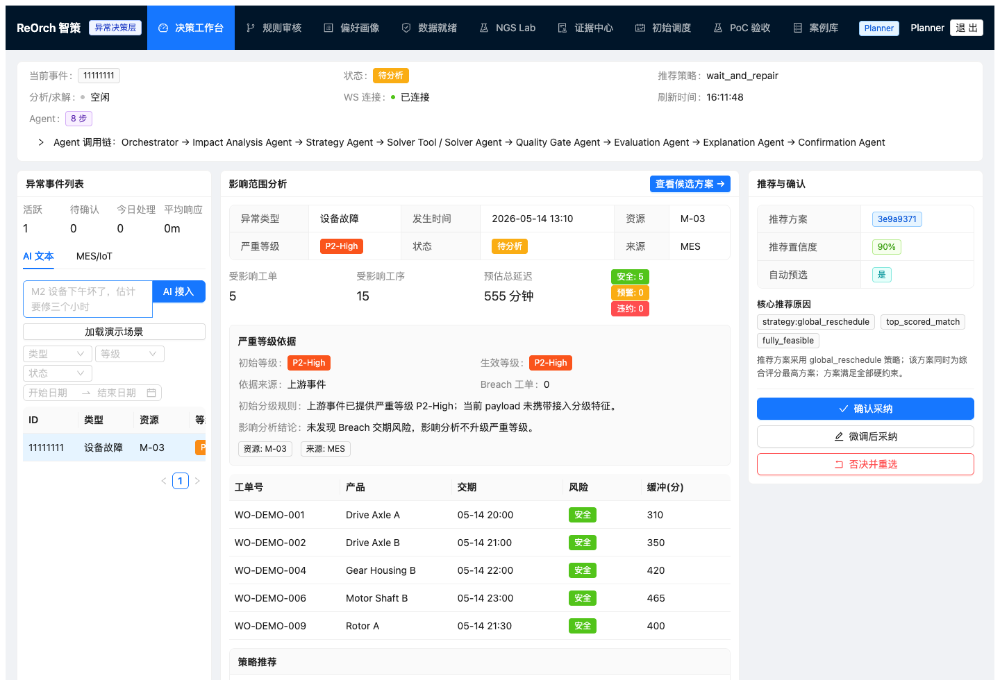
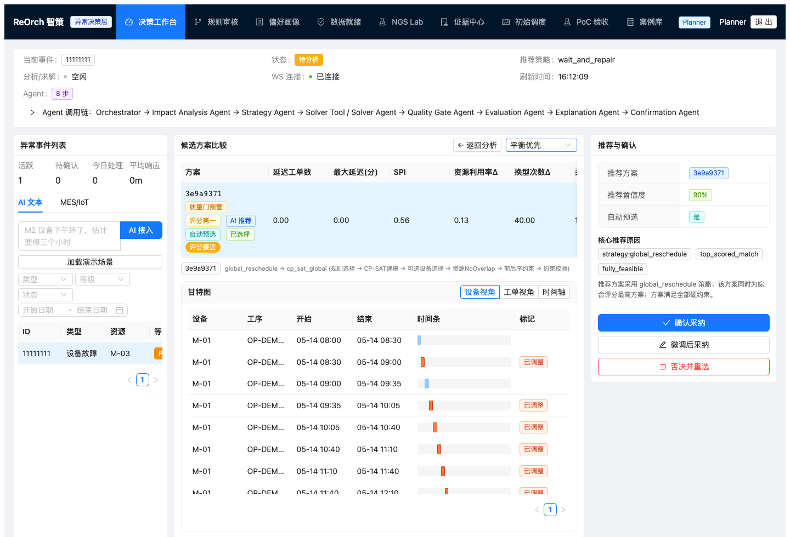
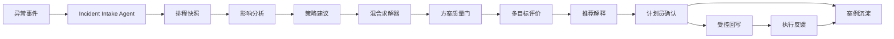

# ReOrch 智策 - 工业异常调度决策 Copilot

## 30 秒速读

- 这是一个高约束场景下的 AI 决策辅助 MVP。
- 已完成可运行 demo、PRD、项目计划、评测、失败样本、截图和材料包。
- AI 不自动决策，只做异常理解、解释、规则候选和经验沉淀。
- 对服务 AI 岗位，可迁移到客服 Copilot、工单 Agent、服务质检。

ReOrch 智策是一个面向离散制造车间的 AI 调度决策 MVP：当设备故障、插单、物料延期、质量返工等异常发生后，系统帮助计划员完成影响分析、策略选择、候选方案生成、多目标评估、人工确认、安全回写和案例沉淀。

项目已完成 MVP 开发，当前正在合作实验室做初步试用和验证。后续会根据试用数据、计划员反馈、异常 replay 结果和系统集成情况继续完善。

当前仓库保留制造调度作为可互动 demo，同时新增 NGS 实验室特化版，说明 ReOrch 的通用异常决策内核如何迁移到样本链路、QC、试剂、hold-time、pool/run 和实验室审计更严格的修复排程场景。NGS 版本基于论文和 synthetic / digital-twin-style 实验包重构，不宣称已经替代 LIMS 或完成生产部署。

与金蝶、ERP、MES、MOM、APS 这类主系统的边界是：ReOrch 不替换主数据、生产执行、制造运营或全厂级计划底座，只补“异常发生后”的影响分析、候选比较、解释、人工确认、审计和经验沉淀。

## 服务 AI 产品能力证据

| 关键能力 | 作品集证据 |
| --- | --- |
| 行业调研 | [市场需求与行业先进标准对标](docs/portfolio/market_benchmark.md)、[金蝶对标下的定位说明](docs/portfolio/kingdee_positioning_note.md)、[服务领域 AI 竞品与标杆能力分析](docs/portfolio/service_ai_benchmark.md)、[服务领域 AI 迁移说明](docs/portfolio/service_ai_transfer_note.md) |
| 用户需求 | [作品集证明材料矩阵](docs/portfolio/portfolio_proof_matrix.md)、[业务流程图](docs/portfolio/business_process_flow.md)、[服务领域 AI 产品能力映射](docs/portfolio/service_ai_role_fit.md) |
| PRD 与技术文档 | [PRD：异常决策工作台](docs/product/prd_decision_workbench.md)、[原型逻辑](docs/portfolio/prototype_logic.md)、[AI 工作流、Prompt 与输入输出示例](docs/portfolio/workflow_prompts_io.md) |
| 项目推进 | [MVP 交付计划与项目推进](docs/project/mvp_delivery_plan.md)、[项目状态评估](docs/portfolio/project_status_assessment.md)、[上线就绪评估](docs/validation/launch_readiness_assessment.md) |
| 上线指标 | [指标体系](docs/portfolio/metric_system.md)、[评测与 Guardrail 用例](docs/portfolio/evaluation_guardrail_cases.md)、[LLM Agent 离线评测](docs/validation/llm_agent_offline_eval.md) |
| 创新输入 | Agent workflow、Data Readiness、Evidence Center、NGS Lab、失败样本库和服务 AI 迁移方案 |

## 作品集能力摘要

| 能力 | 项目体现 |
| --- | --- |
| AI Native 产品设计 | 将异常理解、规则候选、推荐解释、案例沉淀和偏好学习拆成受控 Agent，而不是做泛聊天入口 |
| 生产级边界意识 | LLM 不负责最终排程、硬约束、质量门和回写；高风险动作必须经过求解器、质量门和人工确认 |
| Harness 架构思维 | schema、source refs、fallback reason、quality gate、audit record、demo validation、CI 和测试共同约束模型不确定性 |
| ToB/SaaS 落地 | 支持只读接入、shadow mode、controlled writeback、adapter contract、data readiness 和试点阶段划分 |
| 跨行业迁移 | 底层异常决策内核可迁移到能源、电力、交通、通信、实验室等高约束流程，但生产验证需按行业数据和审计规则重新校准 |
| 跨团队沟通 | 面向业务解释交付风险、扰动和执行复杂度；面向研发对齐 API、状态机、Agent trace、质量门和数据模型 |
| 指标与商业化 | 用 time-to-candidate、Top-K feasible coverage、planner adoption、delay reduced、audit completeness 评估价值 |

## 快速查看

| 材料 | 入口 |
| --- | --- |
| PDF 作品集 | [ReOrch_智策_AI产品作品集_20260603.pdf](portfolio_artifacts/ReOrch_智策_AI产品作品集_20260603.pdf) |
| DOCX 作品集 | [ReOrch_智策_AI产品作品集_20260603.docx](portfolio_artifacts/ReOrch_智策_AI产品作品集_20260603.docx) |
| 完整材料包 | [ReOrch_智策_AI作品集材料包_20260603.zip](portfolio_artifacts/ReOrch_智策_AI作品集材料包_20260603.zip) |

## Demo 截图

<p>
  
  
  
</p>

更多截图见 [docs/assets/screenshots](docs/assets/screenshots)。

## 作品集入口

| 材料 | 用途 |
| --- | --- |
| [AI 产品作品集摘要](docs/portfolio/portfolio_brief.md) | 一页式项目概览：定位、业务问题、AI 能力证据、工作流、验证证据和边界 |
| [服务领域 AI 产品能力映射](docs/portfolio/service_ai_role_fit.md) | 聚合行业调研、用户需求、PRD、项目推进、上线指标和创新输入证据 |
| [服务领域 AI 竞品与标杆能力分析](docs/portfolio/service_ai_benchmark.md) | 对客服 Copilot、工单 Agent、服务质检等方向做能力对标，提炼可迁移设计点 |
| [服务领域 AI 迁移说明](docs/portfolio/service_ai_transfer_note.md) | 说明工业异常决策框架如何迁移到客服 Copilot、工单 Agent、服务质检等场景 |
| [PRD：异常决策工作台](docs/product/prd_decision_workbench.md) | 提供研发可执行的背景、用户故事、范围、页面流程、输入输出、异常状态、权限和验收标准 |
| [MVP 交付计划与项目推进](docs/project/mvp_delivery_plan.md) | 展示需求调研、PRD、原型、开发、联调、灰度、指标看板和风险清单 |
| [作品集证明材料矩阵](docs/portfolio/portfolio_proof_matrix.md) | 用“问题、流程、架构、评测、失败、成本、贡献”证明项目完整闭环 |
| [AI Native 产品经理能力映射](docs/portfolio/ai_native_pm_capability_map.md) | 对应场景理解、Agent/RAG、Harness、ToB/SaaS、指标评测、跨团队沟通和商业化推进能力 |
| [工业 AI Copilot 方案说明](docs/portfolio/industrial_ai_copilot_solution.md) | 说明方案定位、目标用户、系统架构、AI/确定性系统分工、数据边界和交付阶段 |
| [业务流程图](docs/portfolio/business_process_flow.md) | 展示当前业务问题流、目标业务流、泳道图、关键决策节点和状态机 |
| [原型逻辑](docs/portfolio/prototype_logic.md) | 展示工作台信息架构、页面逻辑、状态处理、降级策略和原型验证重点 |
| [指标体系](docs/portfolio/metric_system.md) | 展示 North Star、模型/方案/产品/业务/风险分层指标和采集路径 |
| [评测与 Guardrail 用例](docs/portfolio/evaluation_guardrail_cases.md) | 展示数据缺失、证据不足、硬约束失败、越权回写、低置信解释等测试类别 |
| [失败案例与迭代记录](docs/portfolio/failure_iteration_log.md) | 记录数据缺失、解释过度自信、规则候选误用和 NGS hard gate 等迭代 |
| [成本、延迟与部署边界](docs/portfolio/cost_latency_deployment_boundary.md) | 说明 LLM 使用边界、延迟控制、Agent 最大执行范围和 SaaS 化差距 |
| [个人贡献说明](docs/portfolio/personal_contribution.md) | 汇总问题定义、产品设计、Agent/Prompt、工程实现、验证和公开交付贡献 |
| [项目汇报材料](docs/portfolio/project_report_materials.md) | 提供 10 页汇报结构、三分钟汇报稿、答辩问题和材料包索引 |
| [产品作品集总览](docs/portfolio/product_portfolio.md) | 快速理解项目价值、产品判断和落地证据 |
| [ReOrch 产品说明书](docs/product/reorch_product_overview.md) | 系统化说明产品定位、目标用户、闭环流程、数据门槛和上线边界 |
| [NGS 实验室特化版](docs/portfolio/ngs_lab_specialized_portfolio.md) | 展示已接入系统的 NGS P0：domain adapter、hard gate、Top-K repair portfolio、NGS Lab 前端和 Agent trace |
| [AI 工作流、Prompt 与输入输出示例](docs/portfolio/workflow_prompts_io.md) | 展示 Agent/Workflow 设计、结构化输出、解释与审计样例 |
| [AI 增量 Agent 设计](docs/portfolio/ai_increment_agent_design.md) | 单独说明异常理解、规则候选、推荐解释、案例沉淀和偏好学习 Agent 的职责、输入输出和能力边界 |
| [项目能力证据](docs/portfolio/project_capability_evidence.md) | 展示业务判断、AI 适用性、系统设计、工程落地、风险控制和价值验证 |
| [可信性质量门](docs/portfolio/trust_quality_gate.md) | 展示如何判断 LLM 输出是否可信、可行、可审计 |
| [项目状态评估](docs/portfolio/project_status_assessment.md) | 汇总可信性、成本控制、商业价值、上线边界和后续计划 |
| [上线就绪评估](docs/validation/launch_readiness_assessment.md) | 说明当前能支持的上线范围、不能直接生产上线的原因和进入下一阶段的条件 |
| [数字孪生验证包](docs/validation/digital_twin_validation_pack.md) | 用数字孪生结果补齐 source refs、成本代理、replay/shadow 代理、阈值和审计包结构 |
| [实验室 Replay 与采纳证据](docs/validation/lab_replay_acceptance_evidence.md) | 展示采纳、微调、驳回和失败归因样本，并明确不是客户生产采纳率 |
| [失败样本库](docs/validation/failure_case_library.md) | 展示系统何时不推荐、不自动写回、退回人工判断 |
| [LLM Agent 离线评测](docs/validation/llm_agent_offline_eval.md) | 说明真实 LLM Agent 接入方式、离线评测指标和默认确定性降级 |
| [Data Readiness 停损规则](docs/integration/data_readiness_stop_rules.md) | 明确客户数据缺失时的产品降级、停损线和字段合同 |
| [市场需求与行业先进标准对标](docs/portfolio/market_benchmark.md) | 说明市场切口、行业对标、竞争格局和试点路径 |
| [金蝶对标下的定位说明](docs/portfolio/kingdee_positioning_note.md) | 说明面对金蝶这类主系统厂商时，ReOrch 的补位、首期场景、价值验证和能力边界 |
| [客户演示路径](docs/demo/customer_demo_walkthrough.md) | 端到端演示流程与操作说明 |
| [系统蓝图](docs/product/poc_system_blueprint.md) | 展示 PoC 系统边界、AI 职责和工业现场安全闸门 |

## 快速了解项目

```text
README 首屏
-> AI 产品作品集摘要：快速理解项目定位、能力证据和边界
-> 服务领域 AI 产品能力映射：查看行业调研、用户需求、PRD、项目推进、上线指标和创新输入
-> 服务领域 AI 竞品与标杆能力分析：查看客服 Copilot、工单 Agent、服务质检的公开标杆能力和迁移点
-> PRD：查看异常决策工作台的用户故事、功能范围、权限、埋点和验收标准
-> MVP 交付计划：查看从需求调研到灰度和指标看板的推进路径
-> Demo 截图：快速感知登录、工作台、候选方案、证据中心和数据就绪页面
-> 作品集证明材料矩阵：查看项目如何从提纲变成可验证证据
-> AI Native 产品经理能力映射：查看岗位相关能力证据和技术边界判断
-> 工业 AI Copilot 方案说明：查看方案架构、AI 分工和交付阶段
-> 业务流程图：查看当前流程、目标流程、泳道图和状态机
-> 原型逻辑：查看页面结构、交互状态和降级策略
-> 指标体系：查看 North Star、分层指标和采集路径
-> 评测与 Guardrail 用例：查看数据缺失、证据不足、质量门、权限和解释测试
-> 失败案例与迭代记录：查看失败现象、归因、修改方案和剩余风险
-> 成本、延迟与部署边界：查看真实生产化前的成本、延迟、权限和部署差距
-> 个人贡献说明：查看个人主导的问题定义、设计、实现、验证和交付范围
-> 项目汇报材料：查看 10 页汇报结构和答辩要点
-> 产品作品集总览：理解定位、用户场景和能力边界
-> 可互动 Demo：登录 planner / planner123
-> 决策工作台：查看 Agent trace、Top-K 候选和质量门
-> 规则审核：查看规则候选、人工审核、replay、拒绝原因和只读发布记录
-> 偏好画像：查看确认、驳回和 override 如何影响排序辅助 profile
-> 数据就绪：导入客户 JSON、校验 mapping、查看 readiness 停损规则
-> NGS Lab：读取 batch package、运行 replay、记录 planner confirmation / override
-> 实验室 Replay 与采纳证据：查看采纳、微调和驳回样本
-> 失败样本库：查看系统何时不推荐、不写回、退回人工
-> LLM Agent 离线评测：查看真实 LLM Agent 接入和评测边界
-> 金蝶对标下的定位说明：查看与主系统厂商的边界
```

## 一句话定位

不是“让大模型直接自动排产”，而是把 AI 放在可控的异常决策流程中：LLM/Agent 负责异常理解、规则候选、推荐解释、案例沉淀和偏好学习；约束引擎、求解器、数字孪生、质量门和计划员确认负责正确性与生产责任。

## 三类关键产品判断

| 问题 | ReOrch 的处理方式 |
| --- | --- |
| 为什么上 AI，而不是纯规则/传统 APS/人工试排 | AI 只用于异常语义理解、推荐解释、规则候选、案例沉淀和偏好学习；排程可行性仍由求解器、规则和质量门负责 |
| LLM 用什么模型才够，如何降本增效 | 默认 demo 关闭外部 LLM，保证可复现；低风险 Agent 已支持可配置真实 LLM 调用，高风险求解、质量门、确认和回写不用 LLM |
| LLM 结果如何判断能不能用 | 不让 LLM 自证正确；所有输出必须经过 schema、source refs、硬约束、质量门、数字孪生风险评估、审计和人工确认 |

## 当前状态与上线判断

| 维度 | 当前判断 |
| --- | --- |
| 开发进度 | MVP 已完成，具备端到端异常决策闭环和可互动 demo |
| 验证阶段 | 正在合作实验室进行初步试用和验证 |
| 当前可支持 | 实验室试用、内部演示、只读数据验证、数字孪生 replay/shadow 代理验证、人工确认 dry-run |
| 暂不建议 | 直接接入客户生产环境并开放自动写回或无人值守调度 |
| 下一步 | 用数字孪生验证包先行覆盖 source refs、成本代理、replay/shadow 代理、阈值和审计包结构，再结合实验室反馈迭代 |

结论：当前足够支持受控试用和小范围验证，不足以直接作为生产系统上线。若要进入客户现场上线，应先完成只读接入、shadow mode、人工确认回写演练、回滚预案和审计验收。

## 可互动 Demo

本地完整 demo 使用 Docker Compose 启动后端、前端、PostgreSQL/pgvector、Redis、Redpanda 和 mock ERP/MES/APS 集成服务。

```bash
cp .env.example .env
docker compose up --build
```

打开：

```text
http://localhost:3000
```

演示账号：

```text
planner / planner123
```

推荐演示路径：

```text
登录 -> 决策工作台 -> 加载演示场景 -> 影响分析 -> 候选方案
-> 推荐解释 -> 人工确认 -> 学习闭环证据
-> 规则审核：候选 -> 人工审核 -> replay -> 发布记录/拒绝
-> 偏好画像：确认/驳回/override 只影响排序辅助
-> 数据就绪：导入 JSON -> mapping 校验 -> readiness score
-> NGS Lab：batch package replay -> planner confirmation / override
-> mock MES 回写 -> 案例库沉淀
```

演示材料可直接查看：

- [AI 工作流、Prompt 与输入输出示例](docs/portfolio/workflow_prompts_io.md)
- [Demo Validation Report](docs/demo/demo_validation_report.md)
- [Frontend Demo Path](docs/demo/frontend_demo_path.md)

## 端到端流程



## 核心能力

| 能力 | 项目体现 |
| --- | --- |
| AI 产品定义 | 明确把 ReOrch 定位为“异常响应层 + 经验资产层”，不是重型 APS 替代品 |
| Agent/Workflow 设计 | 受控多 Agent 流程，所有高风险动作都有结构化输入输出、工具边界和人工确认 |
| 工业数据建模 | WorkOrder、Operation、Machine、ScheduleSnapshot、Incident、DecisionRecord 等 canonical model |
| 多目标决策 | 交付风险、扰动范围、换线、资源切换、可行性、置信度和执行复杂度统一评估 |
| 安全与治理 | schema 校验、数据追溯、硬约束质量门、置信度降级、人工确认、幂等回写、审计记录 |
| 商业化试点 | 离散制造 PoC 数据模板、验收指标、ROI 测算、4-6 周落地路径 |
| 工程落地 | FastAPI、React、Ant Design、OR-Tools、Docker Compose、CI 与自动化测试 |

## 验证命令

```bash
pytest -q
cd frontend && npm run build
make demo-validate
```

当前公开分支验证：

```text
726 passed
frontend production build passed
demo data validation passed
```

## 项目结构

```text
app/          FastAPI 后端、领域模型、Agent 工作流、求解器、确认和回写模块
frontend/     React + Ant Design 前端工作台
demo/         固定 sandbox 演示数据和 demo reset/seed 脚本
benchmark/    异常重排 benchmark、客户样例包、回放和训练数据生成脚本
docs/         产品、商业、集成、试点、验证和 portfolio 文档
.github/      CI: backend tests、frontend build、compose smoke
```

## 技术栈

- Backend: FastAPI, Pydantic v2, SQLAlchemy, PostgreSQL/pgvector, Redis, Redpanda/Kafka, OR-Tools
- Frontend: React, TypeScript, Ant Design, Zustand, Vite
- AI/product workflow: controlled Agent orchestration, prompt-to-structure, rule candidate generation, explainability, case memory
- Deployment: Docker Compose, GitHub Actions smoke validation

## 非宣传边界

本项目证明的是 MVP 已完成、可互动 demo 可运行、核心异常决策闭环可验证，并已进入合作实验室初步试用。它不等同于客户生产系统正式上线，也不能宣称大模型可以绕过求解器、质量门或计划员审批直接修改生产计划。
