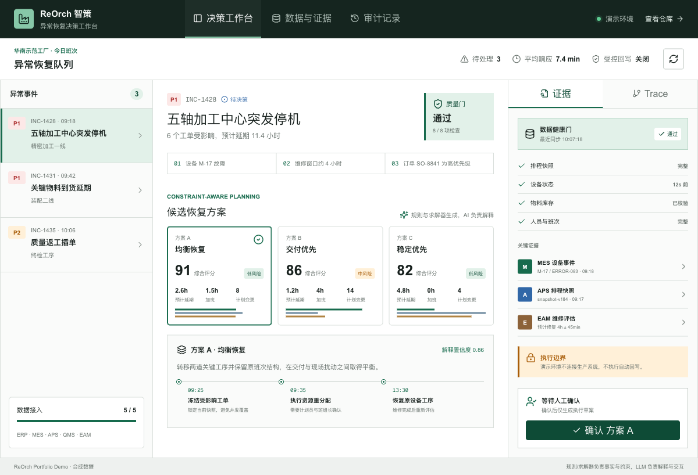
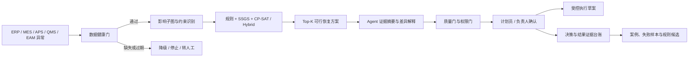

# ReOrch 智策

**工业异常恢复决策 Copilot**

面向设备故障、急单、缺料与质量返工后的高约束决策：ReOrch 位于 ERP / MES / APS 之上，把分散在电话、Excel 和个人经验中的临场协调，重构为“数据健康检查、影响分析、可行候选、证据解释、人工确认、受控执行、结果复盘”的可审计闭环。

[在线互动 Demo](https://reorch-zhice-portfolio.eula-lee001020.chatgpt.site) ·
[正式 Release 下载](https://github.com/eulalee001020-star/reorch-zhice/releases/latest) ·
[PDF 作品集](portfolio_artifacts/ReOrch_智策_AI产品作品集_20260727.pdf) ·
[完整材料包](portfolio_artifacts/ReOrch_智策_AI作品集材料包_20260727.zip) ·
[PRD](docs/product/prd_decision_workbench.md) ·
[验证证据](docs/validation/production_runtime_completion_report_20260712.md)



## 30 秒速读

- **场景**：计划员在高噪声、高时效和多约束环境中处理生产异常，原流程依赖跨部门询问、人工试排与经验判断，数据可信度、执行边界和复盘证据容易断裂。
- **动作**：完成 canonical model、Data Health Gate、影响子图、约束求解、多候选评价、Agent 解释、质量门、双重审批、审计台账与失败关闭机制；同时交付 PRD、原型、项目计划、指标、评测、失败样本和可互动产品。
- **产出**：公开分支收录 872 项自动化测试、三行业合成回放包、10/10 生产运行时数字孪生门、8/8 集成控制面检查和 15/15 回写认证演练检查。以上均为工程与数字孪生证据，不替代客户生产验收。

## 产品差异

ReOrch 不替换金蝶等 ERP、MES、MOM 或 APS 主系统，而是补齐异常发生后的跨系统决策与治理层。

| 对比维度 | ERP / MES / MOM / APS 主系统 | ReOrch 异常响应层 |
| --- | --- | --- |
| 核心职责 | 主数据、业务流程、生产执行、计划与资源管理 | 异常后的影响收敛、候选恢复、风险解释与责任闭环 |
| 典型输入 | 订单、BOM、工艺、库存、设备、基准计划 | 异常事件、最新快照、现场约束、证据来源、审批策略 |
| 方案方式 | 固定规则、人工调整或单一优化结果 | 约束求解生成 Top-K 可行方案，显式比较延期、扰动、成本与执行复杂度 |
| AI 位置 | 通用问答、报表分析或流程助手 | 受控 Agent 负责语义理解、证据摘要、方案解释、规则候选与案例沉淀 |
| 治理机制 | 依赖既有权限与流程配置 | Data Gate、source refs、hard constraints、quality gate、human confirmation、audit ledger |
| 系统边界 | 承担生产主系统职责 | 不自动替代计划员，不绕过主系统，不在证据不足时给强结论 |

关键创新不是“让大模型直接排产”，而是把概率型 AI、确定性求解器和组织责任编排为同一条可验证工作流。

## 决策闭环


```mermaid
flowchart LR
  Event["ERP / MES / APS / QMS / EAM 异常"] --> DataGate["数据健康门"]
  DataGate -->|通过| Impact["影响子图与约束识别"]
  DataGate -->|缺失或过期| Fallback["降级 / 停止 / 转人工"]
  Impact --> Solver["规则 + SSGS + CP-SAT / Hybrid"]
  Solver --> Portfolio["Top-K 可行恢复方案"]
  Portfolio --> Agent["Agent 证据摘要与差异解释"]
  Agent --> Gate["质量门与权限门"]
  Gate --> Confirm["计划员 / 负责人确认"]
  Confirm --> Draft["受控执行草案"]
  Confirm --> Ledger["决策与结果证据台账"]
  Ledger --> Memory["案例、失败样本与规则候选"]
```

## AI 与确定性系统分工

| 环节 | AI / Agent | 规则、求解器与治理 |
| --- | --- | --- |
| 异常理解 | 将自然语言、事件字段和上下文结构化；标记信息缺口 | schema、source authority 和时效校验决定数据能否进入求解 |
| 方案生成 | 不直接生成生产排程 | 约束感知 SSGS、CP-SAT、分解与 anytime hybrid 生成并验证候选 |
| 方案解释 | 基于证据生成差异摘要、风险说明和追问项 | KPI、硬约束与 feasibility certificate 不由 LLM 判断 |
| 规则演进 | 从 override 与失败案例提出待审核规则候选 | replay、人工审核和发布状态机决定规则是否生效 |
| 执行 | 不调用生产写回 | 双审批、短时 permit、幂等键、sandbox certification 和审计记录共同控制 |
| 降级 | 说明不确定性和缺失证据 | 超时、冲突、漂移或权限不足时 fail closed |

详细设计见 [工业 AI Copilot 方案](docs/portfolio/industrial_ai_copilot_solution.md)、[技术内核架构](docs/architecture/constraint_to_recovery_technical_stack.md) 和 [可行性恢复机制](docs/architecture/feasibility_restoration.md)。

## 已验证状态

| 证据层 | 当前公开结果 | 可证明 | 不能外推 |
| --- | --- | --- | --- |
| 自动化测试 | 872 项用例已收集，发布检查以 CI 结果为准 | 领域模型、API、求解、Agent、质量门、审批、回写策略与运行时行为 | 客户环境稳定性 |
| 生产运行时数字孪生 | 10 / 10 gates passed | shadow、schema drift、OIDC/RBAC、备份恢复、观测与证据发布逻辑可执行 | 客户 IdP、HA/DR 与现场运维验收 |
| 集成控制面 | 8 / 8 checks passed | Connector 注册、版本、认证、隔离与失败关闭路径 | 客户 ERP/MES/QMS 字段已接通 |
| 回写认证演练 | 15 / 15 checks passed；customer certification=false | 双审批、幂等、dry-run、回滚与审计协议可验证 | 已获客户生产写回权限 |
| 三行业公开回放 | CNC / 半导体 LED / PCBA synthetic replay pack | 证据结构、ROI proxy、PoC 前检与回放方法 | 真实客户 ROI 或算法优越性 |
| 可行性恢复 | certificate writeback_authorized=false | 不可行诊断、受控约束放宽、恢复操作与审批证书 | 现场策略已由客户责任人签署 |

完整证据见 [生产运行时完成报告](docs/validation/production_runtime_completion_report_20260712.md)、[可行性恢复验证](docs/validation/feasibility_restoration_validation_20260713.md)、[三行业合成回放](docs/validation/three_industry_synthetic_replay_pack_run_20260706.md) 和 [Guardrail 用例](docs/portfolio/evaluation_guardrail_cases.md)。

## 产品交付证据

| 能力 | 交付物 | 证明重点 |
| --- | --- | --- |
| 行业调研与定位 | [市场与先进标准对标](docs/portfolio/market_benchmark.md)、[金蝶定位说明](docs/portfolio/kingdee_positioning_note.md)、[服务 AI 竞品对标](docs/portfolio/service_ai_benchmark.md) | 识别主系统未覆盖的异常响应层，并明确竞合边界 |
| 用户需求 | [证明材料矩阵](docs/portfolio/portfolio_proof_matrix.md)、[业务流程](docs/portfolio/business_process_flow.md) | 从计划员、生产、质量、设备和 IT 角色重构原流程与目标流程 |
| PRD 与原型 | [决策工作台 PRD](docs/product/prd_decision_workbench.md)、[原型逻辑](docs/portfolio/prototype_logic.md)、[互动 Demo](https://reorch-zhice-portfolio.eula-lee001020.chatgpt.site) | 用户故事、状态、权限、异常、埋点、验收与可运行交互闭环 |
| 项目推进 | [MVP 交付计划](docs/project/mvp_delivery_plan.md)、[上线就绪评估](docs/validation/launch_readiness_assessment.md) | 需求、评审、研发、联调、灰度、风险、责任人与阶段门 |
| 上线指标 | [指标体系](docs/portfolio/metric_system.md)、[失败迭代](docs/portfolio/failure_iteration_log.md) | 时效、可行覆盖、采纳、业务代理、稳定性、风险与失败归因 |
| 创新输入 | [AI 工作流与 Prompt](docs/portfolio/workflow_prompts_io.md)、[Agent 设计](docs/portfolio/ai_increment_agent_design.md) | Agent / solver / guardrail / human-in-the-loop 的 Harness 架构 |

## 关键失败与迭代

| 失败现象 | 根因 | 产品与工程修正 |
| --- | --- | --- |
| 数据缺失时仍形成过强建议 | Prompt 只约束输出格式，没有独立的数据准入门 | 增加 Data Health Gate、字段合同、source refs 和停止规则 |
| Agent 将资金流、经验偏好等 proxy 写成事实 | 事实、推断和建议没有分层 | 输出 schema 增加 evidence type、confidence 与 uncertainty |
| RAG / 案例召回可能包含过期信息 | 召回与事实有效性混在同一步 | 加入时效、版本和 source authority 校验，失效证据不进入强结论 |
| 规则候选被误认为已生效约束 | 候选生成与发布状态未隔离 | 建立 draft、review、replay、publish 状态机，只有审核发布规则进入求解 |
| 不可行排程缺少可执行恢复路径 | 只返回 infeasible，未区分约束冲突与业务审批 | 引入 conflict diagnosis、Recovery Operator、受控 relaxations 与 certificate |

更多记录见 [失败案例与迭代日志](docs/portfolio/failure_iteration_log.md) 和 [失败样本库](docs/validation/failure_case_library.md)。

## 在线与本地 Demo

在线版本使用合成数据，聚焦产品逻辑与人机协同：

1. 选择设备停机、物料延期或质量返工异常。
2. 查看数据健康门和关键证据。
3. 比较三个约束可行候选的延期、加班、计划变更与风险。
4. 切换 Evidence / Trace，核对 AI 解释的来源与运行步骤。
5. 人工确认方案；Demo 只生成执行草案，不连接生产系统。

[打开在线互动 Demo](https://reorch-zhice-portfolio.eula-lee001020.chatgpt.site)

本地完整栈包含 FastAPI、React、PostgreSQL/pgvector、Redis、Redpanda 和 mock ERP/MES/APS：

```bash
cp .env.example .env
docker compose up --build
```

打开 `http://localhost:3000`，演示账号为 `planner / planner123`。本地启动详情见 [Demo Walkthrough](docs/demo/customer_demo_walkthrough.md)。

## 作品集材料

| 材料 | 内容 |
| --- | --- |
| [PDF 作品集](portfolio_artifacts/ReOrch_智策_AI产品作品集_20260727.pdf) | 项目背景、用户问题、产品架构、AI 机制、PRD、流程、指标、评测、失败迭代、贡献与边界 |
| [DOCX 作品集](portfolio_artifacts/ReOrch_智策_AI产品作品集_20260727.docx) | 与 PDF 同步的可编辑版本 |
| [完整 ZIP 材料包](portfolio_artifacts/ReOrch_智策_AI作品集材料包_20260727.zip) | PDF、DOCX、README、关键文档、Demo 源码、核心代码、测试与公开验证证据 |
| [项目汇报材料](docs/portfolio/project_report_materials.md) | 10 页汇报结构、三分钟陈述与问答要点 |
| [个人贡献](docs/portfolio/personal_contribution.md) | 问题定义、产品设计、Agent / Prompt、工程实现、验证与交付范围 |

## 项目结构

```text
app/              FastAPI API、领域模型、Agent、求解、质量门、运行时与治理
frontend/         React + TypeScript 产品工作台
portfolio_site/   可独立部署的互动作品集 Demo
datasets/         公开来源与合成可靠性回放包
benchmark/        FJSP benchmark、回放与验证工具
docs/             产品、架构、集成、项目、验证与作品集材料
tools/            可靠性、连接器、运行时和证据验证脚本
.github/          后端测试、前端构建与 compose smoke CI
```

## 技术栈

- **Product / AI**: controlled agent workflow, structured output, evidence-grounded explanation, rule candidate lifecycle, case memory
- **Optimization**: OR-Tools CP-SAT, constraint-aware SSGS, decomposition, anytime hybrid scheduling, quality gate
- **Backend**: FastAPI, Pydantic v2, SQLAlchemy, PostgreSQL / pgvector, Redis, Kafka-compatible event stream
- **Frontend**: React, TypeScript, Ant Design, Zustand, Vite
- **Governance**: data contracts, source authority, OIDC/RBAC, dual approval, idempotency, schema drift quarantine, audit ledger
- **Delivery**: Docker Compose, GitHub Actions, synthetic replay, digital-twin validation

## 验证命令

```bash
uv sync --extra dev
uv run pytest -q
cd frontend && npm ci && npm run build
cd ../portfolio_site && npm ci && npm run lint && npm run build
```

## 当前边界

当前版本属于 **production-minded、replay-ready 的 AI 决策辅助 MVP**：

- 真实 Design Partner 案例数为 0，尚无客户生产数据、现场采纳率或财务确认 ROI。
- 公开结果来自自动化测试、公开来源数据、合成回放与数字孪生演练。
- 生产自动写回默认关闭；即使通过人工确认，也必须另行完成客户 Sandbox、权限、回滚、安全和现场验收。
- LLM 不负责生产事实、硬约束、排程可行性或最终执行责任。

因此，本仓库可以证明完整产品闭环、AI Native 架构、工程实现、评测治理与生产化思考，但不能被解读为已完成客户生产上线。
