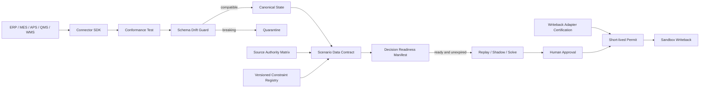

# ReOrch 企业接入治理与回写认证

## 1. 交付边界

本模块实现的是企业数据接入的控制平面，不是通用 ETL 平台，也不允许 Agent 自行认定数据完整或直接写生产系统。

当前数字孪生可以证明：六项资产的注册、版本、激活、隔离、认证和失败关闭逻辑可执行。它不能证明某个客户的 ERP/MES/QMS 字段已经接通，也不能替代客户 Sandbox、权限、灾备和现场验收。

## 2. 运行链路



## 3. 六项可复用资产

| 资产 | 解决的问题 | 激活硬门 |
| --- | --- | --- |
| Source Authority Matrix | 同一字段由哪个系统负责，冲突时如何处理 | 同字段同优先级冲突阻断；回写权威必须使用 `block` 冲突策略；具名 IT_Admin 审批 |
| Scenario Data Contract Registry | 某类异常真正需要哪些字段和约束 | 所有 authority role 必须已存在；字段路径不可重复；版本不可覆盖 |
| Connector SDK + Conformance Test | 不同 ERP/MES 的读取、增量、时点和 lineage 能否稳定复用 | health、schema、幂等快照、UTC、cursor resume、sequence、capability 全部通过 |
| Schema Drift + Quarantine | 上游字段删除、改型或未知实体是否污染状态层 | breaking change 在 CDC 入库前隔离；只能在新 manifest 兼容后释放，或由 IT_Admin 驳回 |
| Versioned Constraint Registry | 隐性规则如何变成可验证硬约束 | compiler + validator + 至少 3 个唯一且实际执行的 replay 结果；Agent 候选不能直接激活 |
| Writeback Adapter Certification Pack | 回写适配器是否具备可恢复、可对账能力 | Sandbox、read-before-write、CAS、幂等、outbox、receipt、reconcile、compensation 全部通过 |

## 4. “数据是否全面”的确定性判定

系统不按“企业所有字段是否导入”判断全面，而按一个具体 `scenario_type` 生成 `Decision Readiness Manifest`。每个硬字段同时检查：

1. authority role 能否解析到唯一权威源；
2. 实际 observation 是否来自该权威源；
3. 数据类型是否兼容；
4. coverage 是否达到合同阈值；
5. freshness 是否仍在有效期；
6. quality rule 是否通过；
7. Connector manifest 与 conformance 是否是同一版本；
8. 硬约束是否存在 active constraint version 及覆盖证据。

任一硬检查失败，manifest 为 `blocked`。软检查失败时为 `degraded`。只有 `ready` 且未过期的 manifest 可以提交受治理求解；Worker 执行前会再次检查，避免排队期间失效。

## 5. Agent 权限边界

Agent 可以：

- 读取 schema/header/sample，提出字段映射候选；
- 解释 authority conflict、缺字段、低 coverage 和时点不一致；
- 从计划员描述中生成 constraint candidate；
- 汇总 replay 失败原因和建议补证据项。

Agent 不可以：

- 指定最终 source of truth；
- 用推断值补齐硬字段；
- 将填写的 `scenario_count` 当作 replay 结果；
- 激活 Source Authority、Scenario Contract 或硬约束版本；
- 释放 quarantine；
- 签发回写认证或短期执行许可；
- 绕过 DataGate、ConstraintGate、QualityGate 或人工审批。

## 6. Connector SDK

客户适配器继承 `app.integration_sdk.EnterpriseConnector`，实现以下确定性方法：

```text
manifest
health()
discover_schema()
read_snapshot()
read_changes(cursor, limit)
read_target(entity_type, entity_id)
sandbox_write(command)
get_receipt(idempotency_key)
reconcile(receipt_id)
compensate(receipt_id)
```

只读 Connector 可以先实现前五项，写路径保持显式不可用。进入回写认证前，manifest 必须声明并真实实现 `idempotent_writes`、`compare_and_swap`、`durable_outbox`、`execution_receipts`、`reconciliation` 和 `compensation`。

运行客户 Connector 测试：

```bash
python tools/run_connector_conformance.py \
  --factory customer_connector.factory:create_connector \
  --tenant-id CUSTOMER_TENANT \
  --evidence-scope customer_sandbox \
  --output output/customer_connector_conformance.json
```

仅在隔离 Sandbox 执行回写认证：

```bash
python tools/run_connector_conformance.py \
  --factory customer_connector.factory:create_connector \
  --tenant-id CUSTOMER_TENANT \
  --evidence-scope customer_sandbox \
  --writeback-adapter-id customer-mes-writeback \
  --output output/customer_connector_and_writeback_certification.json
```

## 7. 客户接入顺序

1. 业务负责人、计划员和 IT 共同确认 Source Authority Matrix。
2. 只选择一个高价值异常，确定 Scenario Data Contract。
3. 在只读账号下实现 Connector；运行 conformance。
4. 提交 schema observation；确认 breaking drift 会进入 quarantine。
5. 导入 10-30 条历史异常，编译约束候选。
6. 每个硬约束执行至少 3 个 replay case，人工审批后激活。
7. 生成 `ready` manifest，开展历史 replay 和只读 shadow。
8. 完成客户 Sandbox writeback certification，再做人工二次审批回写演练。
9. 依据执行回执完成 reconciliation、补偿和审计导出。
10. 客户 sign-off 后，才讨论更高部署等级；当前系统仍禁止无人值守生产回写。

## 8. API

核心接口前缀为 `/api/v1/integration-control`：

```text
GET  /overview
GET  /assets
POST /authority-matrices
POST /authority-matrices/{id}/versions/{version}/activate
POST /scenario-contracts
POST /scenario-contracts/{id}/versions/{version}/activate
POST /connectors
POST /connector-conformance
POST /connectors/{id}/versions/{version}/activate
POST /schema-drift/evaluate
GET  /quarantine
POST /quarantine/{id}/resolve
POST /constraints
POST /constraints/{id}/versions/{version}/activate
POST /writeback-certifications
POST /readiness/evaluate
POST /validation/digital-twin
GET  /audit
```

所有资产激活、隔离处理和认证导入都要求具名 `IT_Admin`。读取 overview 可由租户内用户完成；readiness 可由 `Planner` 或 `IT_Admin` 运行。

## 9. 上线配置

生产部署必须执行：

```bash
alembic upgrade head
```

关键配置：

```text
APP_ENV=production
AUTH_REQUIRE_API_KEY=true
AUTH_MODE=oidc
RUNTIME_DATABASE_URL=postgresql://...
INTEGRATION_WRITEBACK_MODE=disabled
INTEGRATION_REQUIRE_CERTIFIED_WRITEBACK_ADAPTER=true
INTEGRATION_WRITEBACK_ADAPTER_ID=<certified-adapter-id>
```

在 `staging/production`，CDC 事件缺少 `connector_id + schema_fields` 会被阻断；求解缺少 `scenario_type + readiness_manifest_id` 也会被阻断。

## 10. 验收边界

数字孪生总验收：

```bash
python tools/run_integration_control_validation.py \
  --tenant-id digital-twin \
  --output output/integration_control_validation.json
```

客户现场验收必须另行证明：

- 客户 Source Authority Matrix 已由责任人签字；
- Connector 在客户 Sandbox 运行且版本一致；
- Schema drift 告警和隔离演练通过；
- 至少一个场景的硬字段、硬约束和 freshness 全部满足；
- 10-30 条历史异常 replay 可追溯；
- 只读 shadow 有 MES 执行回执；
- Sandbox 回写认证、二次审批、对账和补偿演练通过；
- 客户 IdP、HA、备份恢复、安全和权限审计完成。

只有完成这些客户证据，才能从 `replay-ready` 进入 `shadow-ready` 或 `controlled-pilot-ready`。数字孪生通过不能写成 production-ready。
