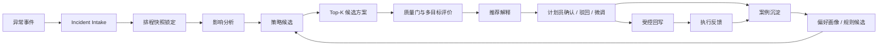
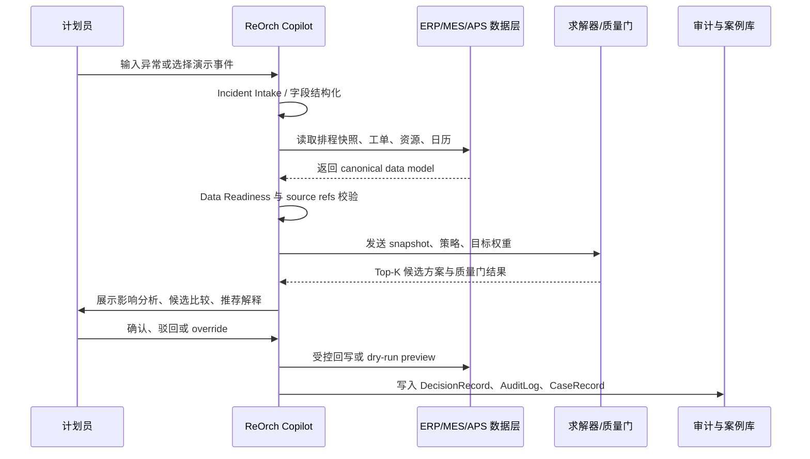
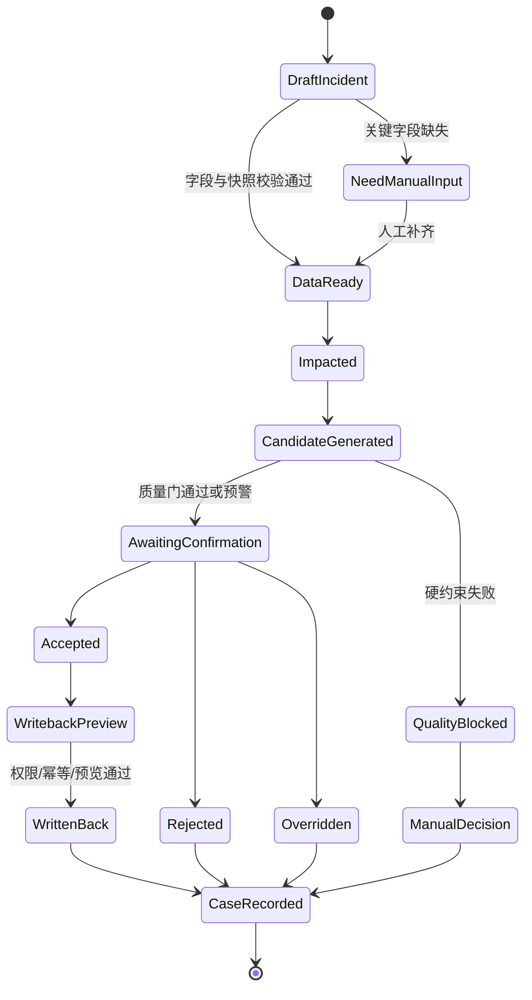

# 业务流程图

## 1. 当前业务问题流

当前流程的问题不是单点效率低，而是决策链路不可复用：异常信息非结构化、影响范围难追溯、方案比较依赖个人经验、失败原因没有沉淀，后续类似异常仍需重新判断。

## 2. ReOrch 目标业务流

目标流程的关键变化是把“个人经验判断”转成“结构化决策记录”：每次异常处理都保留输入、影响、候选、质量门、人工确认、回写结果和执行反馈。

## 3. 端到端泳道图

## 4. 关键决策节点

| 节点 | 输入 | 输出 | 风险控制 |
| --- | --- | --- | --- |
| 异常结构化 | 自然语言、MES/IoT 告警、人工选择 | Incident JSON | 不确定字段标记低置信，进入人工确认 |
| 快照锁定 | 当前排程、资源、工单、日历 | ScheduleSnapshot | 记录版本，避免基于变化中的计划做判断 |
| 影响分析 | Incident + Snapshot | 受影响工序、工单、资源、交期风险 | 结论绑定 source refs |
| 策略选择 | 影响范围、业务目标、约束状态 | wait/local/rolling/global 等策略候选 | 只推荐策略，不直接修改计划 |
| 候选生成 | 策略、约束、目标权重 | Top-K candidate plans | 由求解器生成，LLM 不伪造 KPI |
| 质量门 | 候选方案、硬约束、风险阈值 | pass/warn/block | block 不进入推荐 |
| 人工确认 | 候选、解释、质量门、回写预览 | accept/reject/override | 无确认不回写 |
| 案例沉淀 | 决策记录、执行反馈 | CaseRecord、规则候选、偏好信号 | 单次案例不直接成为硬规则 |

## 5. 业务角色责任

| 角色 | 主要动作 | 系统支持 |
| --- | --- | --- |
| 计划员 | 确认异常、比较候选、选择方案、解释 override | 工作台、推荐解释、人工确认、案例库 |
| 生产主管 | 判断交期风险、资源扰动、执行复杂度 | 影响分析、KPI 矩阵、风险标记 |
| 调度执行端 | 执行确认后的计划调整 | 受控回写、回写预览、幂等记录 |
| IT/集成负责人 | 维护数据映射、接口、权限和审计 | adapter contract、readiness gate、audit package |
| 质量/审计 | 复核决策依据和异常处理记录 | source refs、DecisionRecord、AuditLog |

## 6. 异常处理状态机

