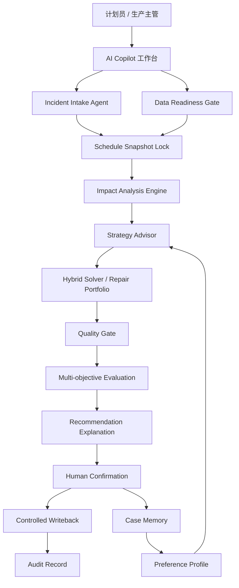

# 工业 AI Copilot 方案说明

## 1. 方案定位

ReOrch 智策是面向高约束工业场景的异常决策 Copilot。它不替代 ERP、MES、APS 或 LIMS 这类主系统，而是在异常发生后补齐“影响判断、候选生成、解释确认、受控回写、经验沉淀”的决策闭环。

本方案的产品判断是：工业现场最需要 AI 的位置不是无人值守自动决策，而是把非结构化异常、现场经验、隐性规则和多目标取舍转化为可验证、可追溯、可人工确认的决策材料。

## 2. 目标用户与核心场景

| 角色 | 当前痛点 | Copilot 价值 |
| --- | --- | --- |
| 计划员 | 异常发生后需要手工判断影响范围、试排多个方案、解释取舍 | 快速形成 Top-K 候选方案、质量门结果和推荐理由 |
| 生产主管 | 需要知道交期风险、扰动范围、瓶颈资源和执行复杂度 | 获得结构化影响分析和风险解释 |
| 车间调度 | 需要把确认后的方案转成执行指令，同时避免重复回写 | 使用受控回写、幂等记录和审计留痕 |
| IT/系统集成负责人 | 需要判断系统能否接入现有数据和主系统边界 | 使用 canonical data model、字段合同和只读/shadow 接入路径 |
| 质量/审计角色 | 需要看到决策依据、人工确认和失败原因 | 使用 source refs、decision record、audit package 和失败样本库 |

首期场景聚焦复杂离散制造的异常重排：设备故障、急单插入、物料延迟、质量返工、瓶颈资源冲突。NGS Lab 特化版展示同一套异常决策内核如何迁移到样本链路、QC、试剂、hold-time、pool/run 和实验室审计更严格的场景。

## 3. 解决方案架构

## 4. AI 与确定性系统分工

| 模块 | AI/Agent 职责 | 确定性系统职责 | 人工确认点 |
| --- | --- | --- | --- |
| 异常理解 | 将自然语言异常、告警文本转成结构化 incident | schema、枚举、时间、ID 校验 | 字段缺失或低置信时确认 |
| 影响分析 | 组织影响解释和风险摘要 | 计算受影响工序、工单、资源、交期风险 | 风险解释是否符合现场判断 |
| 策略建议 | 解释等待维修、局部修复、滚动窗口等策略取舍 | 根据影响范围、约束和历史结果筛选策略 | 是否进入求解 |
| 候选方案 | 不直接生成最终排程 | 求解器生成 Top-K 候选，质量门判断可行性 | 推荐方案确认 |
| 规则候选 | 将现场自然语言规则转成待审核 candidate | 规则作用域、冲突、版本和发布状态管理 | 是否发布或拒绝 |
| 推荐解释 | 用业务语言解释交付、扰动、换线和执行风险 | 绑定 KPI、source refs、质量门结果 | 推荐理由是否可信 |
| 案例沉淀 | 抽取 override 原因、失败标签和可复用经验 | DecisionRecord、CaseRecord、版本快照 | 是否进入案例库 |

## 5. 数据与系统边界

ReOrch 使用 canonical data model 屏蔽不同客户系统差异。核心对象包括 WorkOrder、Operation、Machine、ScheduleSnapshot、Incident、CandidatePlan、DecisionRecord、ExecutionFeedback 和 AuditLog。

接入原则：

- 首期只读接入，不直接修改客户主系统。
- 通过 shadow mode 比较系统候选方案与计划员实际方案。
- 只有人工确认、权限校验、回写预览和幂等检查通过后，才进入受控回写。
- 数据缺口触发降级：字段不完整时只做影响说明或人工检查清单，不输出自动推荐。

## 6. 工程落地形态

| 层级 | 当前实现 |
| --- | --- |
| 后端服务 | FastAPI、Pydantic、SQLAlchemy、Agent workflow、求解器、质量门、审计和 API |
| 前端工作台 | React、Ant Design、Zustand，覆盖决策工作台、规则审核、偏好画像、数据就绪、NGS Lab |
| 求解与评测 | OR-Tools、hybrid solver、multi-objective scoring、digital twin replay/shadow 代理 |
| 集成模拟 | mock ERP/MES/APS、demo 数据、adapter contract、mapping validation |
| 质量治理 | schema 校验、source refs、hard gate、fallback reason、DecisionRecord、failure case library |

## 7. 交付阶段

| 阶段 | 目标 | 验收标准 |
| --- | --- | --- |
| Lab Trial | 验证核心工作流、异常建模、Top-K 候选和解释是否可用 | 10-30 分钟内形成候选方案，记录人工采纳/微调/驳回原因 |
| Read-only Pilot | 接入客户只读数据，跑历史异常 replay | source refs 覆盖核心结论，数据缺口进入 readiness 停损规则 |
| Shadow Mode | 系统方案与计划员实际方案并行对比 | Top-N 覆盖、低风险采纳率、失败归因、风险阈值可量化 |
| Controlled Writeback | 人工确认后在 sandbox 或低风险场景演练回写 | 权限、幂等、回滚、审计包通过验收 |
| Production Scope | 小范围生产上线 | 仅开放已验证场景，不支持无人值守自动调度 |

## 8. 关键边界

- 不宣称大模型可以直接替代计划员、求解器或工业主系统。
- 不把 synthetic / digital-twin-style 验证等同于客户生产数据验证。
- 不在数据缺失、质量门阻断、低置信或无人工确认时输出可执行回写。
- 不把单次案例直接升级为硬约束；规则候选必须经过审核、replay 和版本发布。
