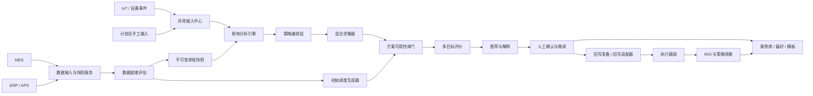

# ReOrch 初代可用系统蓝图

目标：支撑 4-6 周付费 PoC，而不是一次性完成全厂级 APS 替代。

## 1. 初代可用定义

初代可用系统必须完成两类任务：

1. 从零生成多套初始调度方案，帮助客户在没有可靠基准排程时形成可执行计划。
2. 在异常发生后，基于当前排程快照快速生成可执行重决策方案，并记录人工确认和执行结果。

初代系统的最小闭环：

- 数据接入校验。
- 初始调度方案生成。
- 异常接入。
- 快照锁定。
- 影响分析。
- 策略选择。
- 候选方案生成。
- 方案可用性闸门。
- 多目标评价。
- 人工确认。
- 回写准备。
- ROI 记录。
- 案例沉淀。

## 2. 客户侧准备

客户需要准备的数据分为必需、强建议、可后补三类。

### 2.1 必需数据

- 车间/产线/设备清单。
- 设备能力标签。
- 工单列表。
- 工序列表。
- 工序时长或标准工时。
- 工序前后约束。
- 每道工序可选设备。
- 工单交期。
- 当前计划开始/结束时间，异常重排时必需。
- 当前执行状态：未开始、进行中、已完成、冻结。
- 异常事件：类型、发生时间、资源、预计恢复时间、来源。

### 2.2 强建议数据

- 产品族/换线规则。
- 换线时间或换线成本。
- 物料齐套时间。
- 设备日历、班次、维护窗口。
- 关键客户/关键订单标识。
- 外协资源和响应时间。
- 历史异常日志。
- 历史排程版本。
- 实际完工数据。

### 2.3 可后补数据

- 能耗成本。
- 人员技能矩阵。
- 工装夹具约束。
- 质量返工概率。
- 更细粒度物流搬运时间。

## 3. 输入方式

PoC 阶段支持三种输入方式：

- 文件导入：CSV/JSON/Excel 模板，用于最快启动。
- API 接入：ERP/MES/APS 推送工单、排程快照和异常事件。
- 手工录入：用于补充预计维修时长、临时锁定规则、人工约束。

推荐顺序：

1. 先用文件导入跑通历史 replay。
2. 再接异常事件 API。
3. 最后接回写接口。

## 4. 系统框架



## 5. 如何确保结果可行可用

系统必须区分“数学可行”和“现场可用”。

数学可行：

- 工序前后关系不冲突。
- 同一资源同一时间不重叠。
- 工序分配到具备能力的设备。
- 冻结工序不被移动。
- 物料可用时间不晚于工序开始。
- 计划时间落在资源可用日历内。

现场可用：

- 换线次数没有不可接受地增加。
- 关键设备利用率在合理范围。
- 关键订单风险被明确暴露。
- 调整范围不会造成全车间震荡。
- 方案能被计划员理解和解释。
- 回写指令能被 MES/APS 接收。
- 若系统低置信度，必须提示人工确认，而不是伪自动化。

方案进入确认前必须经过“方案可用性闸门”：

- 硬约束失败：禁止推荐。
- 数据缺失严重：降级为建议，不允许自动预选。
- 多方案分数接近：提示人工权衡。
- 执行复杂度过高：标记风险并给出替代方案。

## 6. AI 如何形成企业可复用资产

AI 不直接绕过求解器决定排程。更合理的角色是编排、解释、偏好学习和资产沉淀。

需要沉淀的资产：

- 异常类型。
- 影响范围。
- 触发判断。
- 采用策略。
- 候选方案 KPI。
- 计划员选择。
- 人工微调内容。
- override 原因。
- 回写结果。
- 实际执行结果。
- 策略效果。

资产如何复用：

- 相似异常检索：下次出现类似事件时引用历史案例。
- 偏好学习：识别某车间/计划员在交付、稳定、成本之间的真实取舍。
- 策略模板：当同类异常达到一定次数后，形成可审核模板。
- Replay 评估：新策略先在历史案例上回放，不直接上线。
- 置信度控制：只在高相似、高可行、高采纳场景中自动预选。

## 7. AI 在 ReOrch 里的 5 类作用

AI 在 ReOrch 中不替代排程优化器，也不直接生成最终可执行排程。AI 的作用压缩为五类：事件理解、字段补全与异常归类、策略推荐、方案解释、反馈沉淀。

### 7.1 事件理解

AI 可以把自然语言异常描述转成结构化 Incident。

输入：

```text
M2 设备下午坏了，估计要修三个小时，几个急单可能要受影响。
```

AI 辅助输出：

```json
{
  "incident_type": "machine_down",
  "machine_id": "M2",
  "estimated_duration": 180,
  "risk_hint": "urgent_order_delay"
}
```

### 7.2 字段补全和异常归类

AI 可以根据上下文补全异常类型、影响对象和风险提示。

| 输入 | AI 辅助输出 |
| --- | --- |
| CNC-02 停了 | machine_down |
| 物料还没到 | material_shortage |
| 客户加急 | urgent_order_insert |
| 设备产能下降 | capacity_degradation |

字段补全必须带置信度。如果置信度低，系统进入人工确认，而不是自动进入求解流程。

### 7.3 策略推荐

AI 可以结合规则结果生成策略建议，例如：

> 当前影响范围局部，紧急订单风险中等，建议优先尝试 Local Repair。

但真正的判断依据必须来自可计算字段：

- 影响工序数。
- 受影响订单数。
- downtime。
- slack。
- priority。
- 可替代机器数量。
- 当前设备负载。

### 7.4 方案解释

AI 可以把方案对比转成计划员能理解的自然语言。

示例：

> Plan B 虽然 makespan 比 Plan C 高 15 分钟，但少调整 10 道工序，现场执行风险更低。

AI 只解释已有指标和方案变化，不得修改指标、隐藏风险或重写求解结果。

### 7.5 反馈沉淀

AI 可以把人工 override 原因结构化，为后续案例检索、规则优化和策略学习提供资产。

```json
{
  "override_reason": "operator_preference",
  "reason_detail": "M4 operator unavailable after 16:00",
  "future_rule_candidate": "avoid assigning urgent jobs to M4 after 16:00"
}
```

这一步很重要，因为它体现系统的长期进化能力：系统不是只给一次性建议，而是把人工判断沉淀成可复用的规则候选、偏好画像和策略效果数据。

## 8. 初始调度与异常重排的关系

初始调度解决“从订单和资源出发，生成基准计划”的问题。异常重排解决“计划执行中被扰动后，如何最小代价恢复”的问题。

两者共用：

- 工单、工序、资源、能力、日历、物料约束。
- CP-SAT/启发式/局部搜索求解能力。
- 多目标评价体系。
- 方案解释和人工确认界面。
- 案例与偏好资产层。

不同点：

- 初始调度没有基准扰动量，重点是交付、吞吐、瓶颈、换线。
- 异常重排有冻结区和当前执行状态，重点是少改动、快恢复、可回写。

商业建议：BP 主切口仍以异常重决策为主，因为更容易证明紧迫性和 ROI；初始调度作为通用能力和 upsell 能力。

## 9. PoC 实施路径

### 第 1 周：数据与场景确认

- 明确一个车间和一个高频异常。
- 收集 3-6 个月异常日志。
- 收集至少 20-50 个历史排程快照或典型订单集。
- 建立数据字段映射。
- 输出数据就绪评估。

### 第 2-3 周：历史 replay 与初始调度

- 从历史订单生成多套初始方案。
- 用历史异常 replay 验证影响分析和重排。
- 校准 KPI 权重。
- 校准硬约束和现场不可接受规则。

### 第 4 周：现场试运行

- 接入实时或准实时异常。
- 系统生成候选方案，计划员确认。
- 回写先采用人工审核模式。
- 记录每次人工选择和原因。

### 第 5-6 周：ROI 与转化

- 对比现状流程耗时。
- 汇总方案采纳率。
- 统计延期、换线、加班、协调轮次变化。
- 输出续费建议和扩展路线。

## 10. 当前实现缺口

现有代码已经具备异常接入、受控 Agent 工作流、影响分析、策略选择、求解、评价、解释、确认、反馈归因沉淀、案例库、初始调度、方案质量闸门、ROI 估算、数字孪生样例、可配置客户适配器、PostgreSQL 优先持久化、登录/RBAC、后台任务、Docker Compose 和 CI。

下一阶段必须补齐：

- 用真实客户数据验证 ERP/MES/APS 字段映射和接口协议。
- 将客户系统鉴权从 PoC API Key 升级为企业 SSO / OAuth / 专线网关方案。
- 将案例库和偏好画像从通用版本表升级为专用查询模型与向量检索索引。
- 补充真实物料、日历、换线、人员技能、工装夹具约束的客户级校准。
- 增加线上观测面板、告警策略、备份恢复和部署验收脚本。
- 增加前端权限级菜单、操作审计查看和失败回写处理页面。
- 在客户现场跑历史 replay，确认策略推荐与方案解释是否符合计划员实际判断。

## 11. 不做事项

PoC 阶段不做：

- 全厂级 APS 替代。
- 完全无人确认自动回写。
- 跨集团多工厂优化。
- 未经数据积累的强化学习上线决策。
- 对所有行业泛化承诺。
